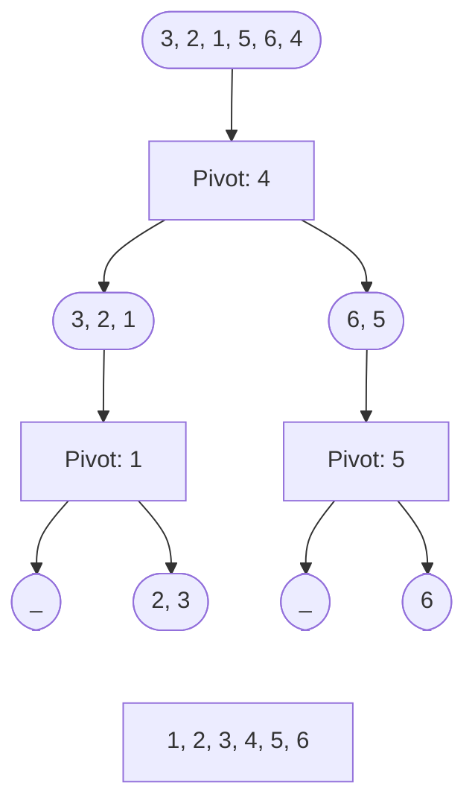

## Intro

Recently, I watched Neetcode use the quickselect algorithm to solve Leetcode 215 (k-th largest element in an array). Quickselect is a variation of quicksort, which inspired me to learn the sorting algorithm behind it. In this article, I'll walk through how quicksort works and how to implement it in Python.

Quicksort is a divide-and-conquer algorithm, which means it breaks the problem into smaller parts and solves each part recursively.

## Let's Think

### Problem Statement: Sorting an Array

Imagine you have an unsorted array and you need to sort it

```python
arr = [3, 2, 1, 5, 6, 4]
```

Our goal is to transform it into a sorted array:

```python
[1, 2, 3, 4, 5, 6]
```

To achieve this, we'll implement Quicksort, which uses two main functions: `partition(arr, low, high)` and `quicksort(arr, low, high)`.

### Partitioning: The Key to Quicksort

Partitioning is the heart of Quicksort. We select a "pivot" and rearrange the array so that elements smaller than the pivot move to the left, and larger elements move to the right.

Here is how it works:

1. **Select the pivot**: We choose the last element as the pivot:
   - `pivot = array[high]`
   - Set `i = low - 1` to keep track of smaller elements.
   - Choosing the last element as a pivot is a common approach, however it can degrade performance to $$ O(N^2) $$. You could also instead choose a random pivot or the median element, which can improve performance.
1. **Rearrange the elements**: Iterate over the array and compare each element with the pivot

   Example with `arr  = [3, 2, 1, 5, 6, 4]`:

   ```
     3 < 4: i += 1
     2 < 4: i += 1
     1 < 4: i += 1
     5 > 4: do nothing
     6 > 4: do nothing
   ```

1. **Swap with the pivot**: Finally, swap the pivot with the first element that is greater than it:

   - Swap `arr[i+1]` with `arr[high]`.

   - Our array looks like this now:

     ```python
     [3, 2, 1, 4, 6, 5]
     ```

1. **Recursively sort**: Recursively apply the partitioning algorithm to the left and right sub arrays.
   - Base case: `low >= high`, it means the sub array has one or no elements, and there's nothing to sort.
   - Recursive case `low < high`.

## Lets Build

```python
def partition(arr, low, high):
    pivot = arr[high] # We chose the last element as the pivot
    i = low - 1 # Pointer for smaller elements

    for j in range(low, high):
        if arr[j] < pivot:
            i += 1
            arr[j], arr[i] = arr[i], arr[j]
    arr[i + 1], arr[high] = arr[high], arr[i + 1] # Swap pivot to its correct position

    return i + 1 # return pivot index; separates our array into halves!

# The recursive calls on quicksort(arr, low, pivot_idx - 1) and quicksort(arr, pivot_idx + 1, high) progressively
# reduce the problem size by sorting smaller sections of the array until each part has only one element.
def quicksort(arr, low, high):
    if low < high:
        pivot_idx = partition(arr, low, high)

        # Recursively sort elements before and after partition
        quicksort(arr, low, pivot_idx - 1)  # Sort left sub array
        quicksort(arr, pivot_idx + 1, high) # Sort right sub array
```

## Algorithm Walkthrough



## Complexity

### Time

- **Best Case**: $$ O(N log(N)) $$ – The pivot divides the array into equal halves, reducing the number of recursive calls.

- **Average Case**: $$ O(N log(N)) $$ – This is the expected time complexity for most input cases.

- **Worst Case**: $$ O(N^2) $$ – Occurs when the pivot consistently partitions the array in a highly unbalanced way (e.g., the smallest or largest element is always chosen as the pivot).

### Space

- **Average Case**: $$ O(log(N)) $$ – where the partition is balanced so you do less recursion calls meaning smaller call stacks.

- **Worst Case**: $$ O(N) $$ – where the partition is unbalanced so you do most recursion calls making a big call stack.

## Minor Section

### Caveat

Quicksort is not a stable sorting algorithm, it does not preserve the relative order of equal elements, in which case merge sort may be more suitable.

### Edge Cases:

- If we have an empty array `[]` our function returns does nothing.
- If we have one element `[1]` our function does nothing.
- If we have identical elements `[1, 1, 1]`, our function runs switching position of elements.

## Recap

In summary, Quicksort efficiently sorts an array by dividing it into smaller sub arrays using a pivot. By recursively applying the partitioning process, the array is sorted in place.

## Further Reading

- [GeeksForGeeks](https://www.geeksforgeeks.org/quick-sort-algorithm/)
- [Stack Overflow](https://stackoverflow.com/questions/13498213/quicksort-algorithm-stability)
